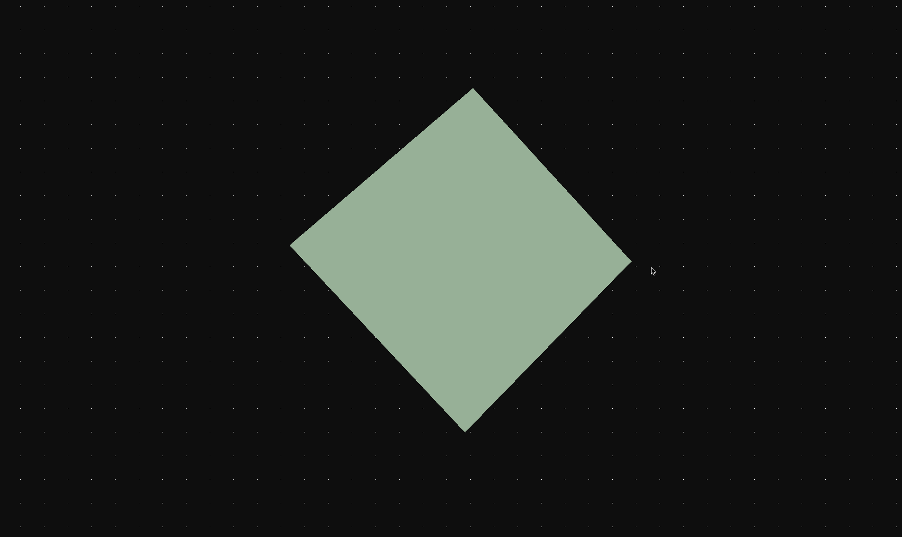

# RedWood3D
A 3D renderer personal project to learn computer graphics programming fundamentals.

This Project is based on software rendering. (Refering to rendering process that is not dependent on graphics hardware).

I use SDL as a means to open a window. All other graphics elements will be coded from scratch.

A sample of the default cube being rendered! Using nothing but code and math!

## Notice of Dependencies
 - SDL
 - Unix based (Mac and Linux)

Does not include support for windows machines. Looking to do that in a future update.

## Current Implementations
- Vector and Matrix mathmatics operations.
- Color Buffer for drawing pixels to the screen.
- DDA line algorithm.
- Wireframe and triangle rasterization (fill flat top and bottom).
- Weak perspective.
- World Matrix calculations for mesh transformations.

## Current and Future development
- Read Obj files to import different models.
- Simple camera movement system using look at function and robust projection matrix for perspective.
- Texturizing mesh from png data.
- Develop a clipping algorithm.
- Cross platform use and build method (cmake).
